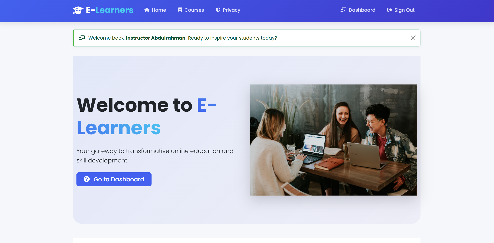
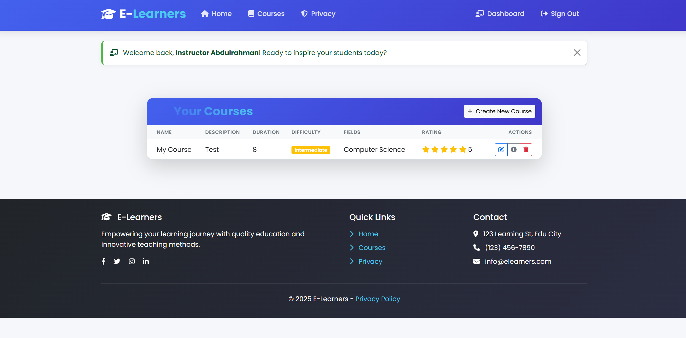
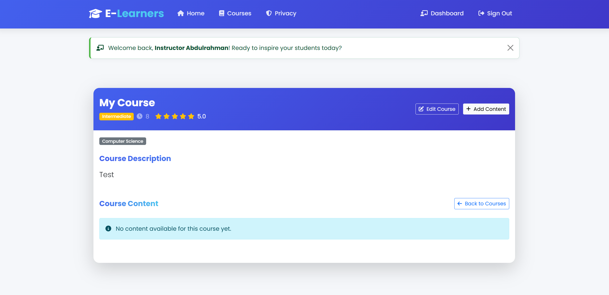
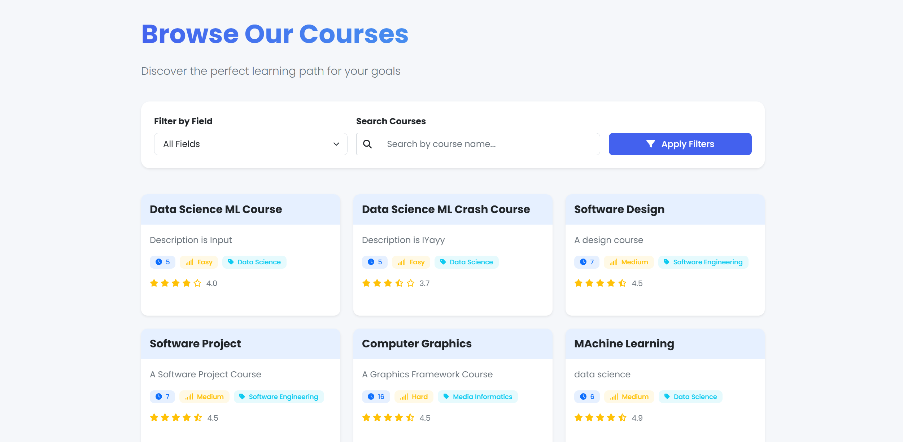
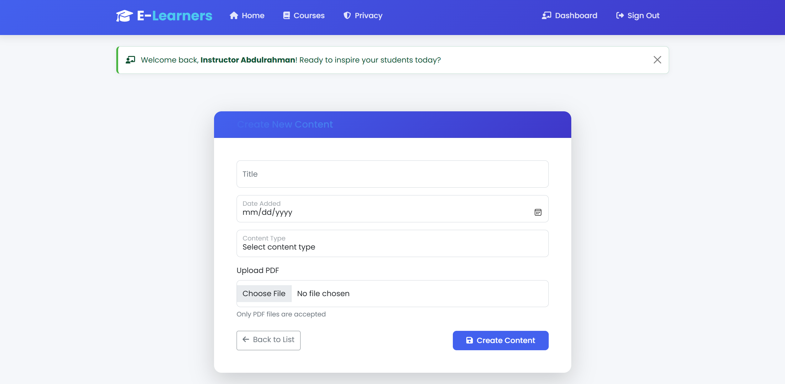

# E-Learning Platform

### This is a very simple and basic E-Learning Platform that was created using .NET MVC. The website uses MicrosoftSQL for the backend and MVC(Model, View, Controller) architecture in the frontend.
### Instructors on the website can sign-up, login, create and delete courses, and add content to the course
### Students on the website can sign-up, login, view all course, enroll in courses, view course content, and rate courses

## Some Screenshots

